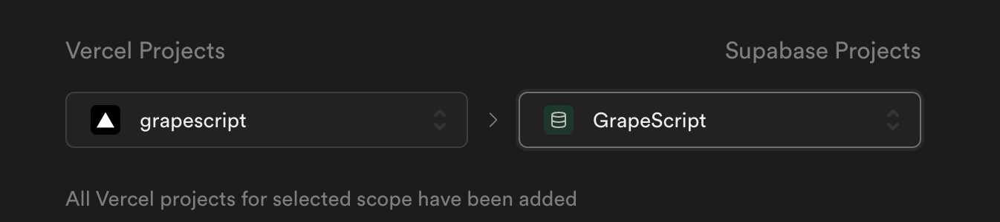

### タイピングアプリ (仮)


**方向性**
- styled-componentではなくcss moduleを使う
- storybookには価値のあるコンポーネントだけ載せる
- 無駄なコンポーネントは作らないようにする
- memo.mdに色々書く，後々Qiitaにあげる
- cssのクラス名はハイフンではなくアンダーバーで区切る


**nextプロジェクトの作成**
```
    npx create-next-app@latest --ts <プロジェクト名>
```

**ルーティング**
```
    function Sample() {
        return <span>サンプルのページです</span>
    }

    // ページコンポーネントはexport defaultする
    export default Sample
```

**Storybook**

- storybookの導入
```
    npx sb@latest init
```

- storybookの起動
    - 現状docker composeでnextの開発サーバーとstorybookを同時に起動出来てない (バックグラウンドでどっちかを起動出来てない)
```
    npm run storybook
```

**Jest**

- Jestの導入
```
    npm install --save-dev jest @testing-library/react @testing-library/jest-dom
    npm install --save-dev jest-environment-jsdom
```

- スクリプトの登録 (`package.json`)
```
    "scripts": {
        "dev": "next dev",
        "build": "next build",
        "start": "next start",
        "test": "jest --watchAll",
        "lint": "next lint",
        "storybook": "storybook dev -p 6006",
        "build-storybook": "storybook build"
    },
```

- `jest.config.js`ファイルの作成

- https://zenn.dev/miruoon_892/articles/e42e64fbb55137
- https://zenn.dev/keita_hino/articles/488d31e8c4a240

**環境変数**
- `env`ファイル名に応じて読み込まれるかどうかが決まる
- `.env.local`, `.env.development.local`, `.env.production.local`はgit管理しない
- `.env`, `.env.development`, `.env.production`はgit管理しても良い (管理して良いものを入れる)

- 先頭に`NEXT_PUBLIC_`がつく変数はクライアントでも呼び出せる
- 使うときは`process.env.NEXT_PUBLIC_****`のようにする

- https://fwywd.com/tech/next-env


**Supabase連携**


- Vercelとローカル環境のリンク (.env.localファイルが作成される)
```
    npx vercel link
    npx vercel env pull
```

- Supabaseとローカル環境のリンク
```
    npm install --save-dev @types/node
    npm install @supabase/supabase-js
```

- alpine linuxだと必要なパッケージがある
```
    apk update && apk add --no-cache python3 make g++
```

- https://tech-blog.rakus.co.jp/entry/20220928/vercel

Supabase CLIのインストールとか
- https://zenn.dev/razokulover/articles/db984ebfcf4bf6